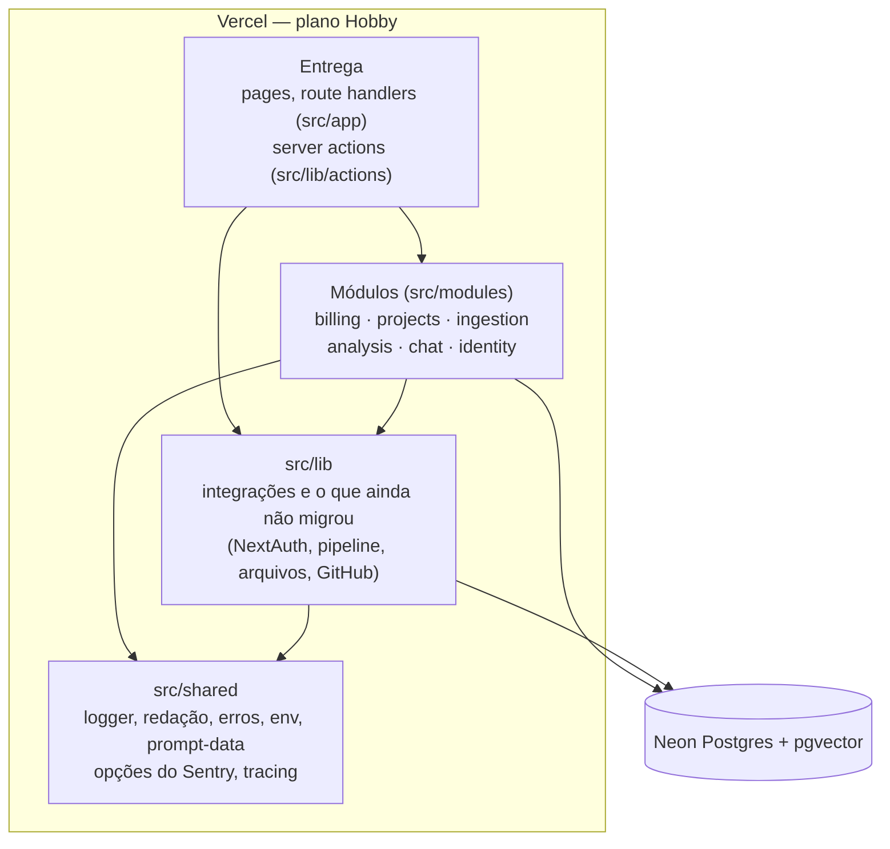

# Arquitetura atual

Retrato de **como o sistema é hoje** (fim da Fase 3 do
[roadmap-v2.md](roadmap-v2.md), com o que as Fases 7 e 4 acrescentaram): um monólito modular com Clean Architecture
e DDD aplicados só onde há regra de negócio ([ADR-001](decisions/001-modular-monolith.md)).
O "antes" está em [architecture-baseline.md](architecture-baseline.md); a
comparação medida, em [results-phase-3.md](results-phase-3.md). Convenções
dos módulos em [modules.md](modules.md); linguagem em [glossary.md](glossary.md).

## C4 — nível 1: contexto

Igual ao baseline: o app (Next.js na Vercel) fala com Neon Postgres +
pgvector, Groq (LLM), Hugging Face Hub (modelo de embeddings no cold start),
GitHub (OAuth e zipball), Google (OAuth) e Stripe (checkout e webhook
assinado). Desde a Fase 4, também com o Sentry (erros e traces, sem PII nem
código do usuário).

## C4 — nível 2: contêineres e camadas

- **A entrega não toca o banco:** nenhum arquivo de `src/app` importa o
  cliente do Drizzle nem o schema (era 12). Pages e rotas chamam as APIs
  públicas dos módulos.
- **Mesmo deploy, mesmos limites:** um app Next.js 16, no máximo 12 funções
  (Hobby); o runtime ONNX só na função `flow` do Workflow (onde rodam os
  steps da análise) e no `chat`. A análise roda como Vercel Workflow
  ([ADR-005](decisions/005-job-runner.md)); a importação ainda na request.

## Módulos

Cada módulo expõe `index.ts` (puro: tipos e regras, importável até por
componentes de cliente) e `server.ts` (`server-only`: tudo que usa banco,
rede ou modelo). O interior (`domain/`, `application/`, `infrastructure/`)
é privado.

| Módulo | Domínio (puro) | Application / portas | Infraestrutura |
|---|---|---|---|
| **billing** | planos, limites, cota (dia UTC, carência do `past_due`), `entitlementFor` | `createQuota` + porta `BillingRepository` | repositório Drizzle, `withQuota` (lock + checagem + uso numa transação), Stripe atrás de uma camada anticorrupção (`translate.ts`) |
| **projects** | ciclo de vida (`analysisStart`, `ACTIVE_STATUSES`, `STALE_AFTER_SECONDS`), link público (`isShareActive`, `redactForPublic`) | — | todas as escritas de status num arquivo, queries das pages, importação (`importArchive`), links públicos (só o hash do token) |
| **ingestion** | `EMBEDDING_DIMENSIONS` (fonte única), `ChunkDraft` | `storeKnowledge` + portas `Embedder` e `VectorStore` | ONNX (MiniLM q8, revisão fixada), pgvector |
| **analysis** | `Finding` (com evidência opcional), uma `Rule` por heurística, `ScoringPolicy` (`linearPenaltyPolicy`) | — | a geração do relatório ainda está em `src/lib/analysis/report.ts` |
| **chat** | política do prompt (código como dado), extração da pergunta | — | busca de contexto via ingestion |
| **identity** | — (dados e integração) | — | conta, conexão com o GitHub (páginas só recebem um booleano), cadastro, credenciais, o que cada login registra |

**Portas** só onde há duas implementações ou um teste precisa de fake:
`Embedder`, `VectorStore` e `BillingRepository`. `LlmProvider` nasce com o
Ollama (v2.2); `AnalysisRunner`, com a fila (Fase 5).

## Regras verificadas no CI (`npm run lint:arch`)

`dependency-cruiser`, bloqueando o merge; **baseline de violações: 0**.

- `domain/` não importa application, infrastructure, `src/lib`, `src/db`
  nem frameworks.
- `application/` não importa infrastructure nem Drizzle/Stripe/Next.
- Fora de um módulo, só `index.ts` e `server.ts`.
- `index.ts` não importa banco nem `server-only`.
- Sem React dentro de módulos; sem ciclos; produção não importa testes.
- `src/app` e `src/components` não importam o banco (imports de tipo são
  permitidos).

## Fluxos principais

### Importação (GitHub ou ZIP)

**GitHub (no job, ADR-005):** server action (sessão, zod, duplicado,
conexão) → `startGitHubImport` (projects): `withQuota` cria o projeto e
registra o uso → `startAnalysisRun` dispara o `analysisWorkflow` com
`fetchFromGitHub` e a action responde na hora. O primeiro step
(`fetchGitHubSourcesStage`) baixa o zipball, extrai e grava os arquivos
(projeto continua `processing`), e o workflow segue para a análise. O
GitHub recusar ou falhar devolve a análise (como antes, quando o download
vinha antes da cota); arquivo sem nada para analisar continua cobrado. A
reanálise de um projeto GitHub usa o mesmo step; nome do repositório e
conexão são checados antes da cota.

**ZIP com object storage (ADR-011, até 100 MB):** `prepareZipUpload`
(sessão, nome, tamanho, duplicado, rate limit; sem cota) assina um POST para
`uploads/<userId>/<uuid>.zip` no bucket do Neon → o navegador envia direto
ao bucket (a Vercel limita o corpo da request a 4,5 MB) → `startZipUpload`
confere que a chave é do usuário e o objeto existe dentro do limite, cria o
projeto sob a cota e dispara o workflow com `uploadKey` → o step
`fetchUploadedZipStage` lê, extrai, grava e apaga o upload. Arquivo inválido
continua cobrado; falha nossa devolve a análise (ADR-003). O reaper apaga
uploads abandonados. Configuração: [runbook](runbooks/object-storage.md).

**ZIP sem object storage (dev local, CI):** server action → `importArchive`
na request, limitado a 4 MB (TD-45) → projeto `queued` → a página de
progresso dispara a análise.

### Análise

Página de progresso (`useAnalysisProgress`) → `POST /api/projects/:id/analyze`
→ `analysisStart` decide e `claimAnalysis` faz o claim atômico (projects) →
`enqueueAnalysis` dispara o `analysisWorkflow` e a rota responde na hora; a
página lê o progresso que os steps gravam (`/status`). Steps
(`analysis-workflow.ts`): [GitHub ou upload →] embedding em lotes de até
1.000 chunks, um step cada, guardados em `embedding_cache` (ADR-006) →
conhecimento (troca de uma vez, sem embedar) → relatório → conclusão, só ids
entre eles; erro do usuário e cancelamento encerram (`FatalError`), o resto
tem 2 retries com mensagem genérica; um run que morre sem gravar a falha
termina em `failRunningAnalysis`. Dentro dos steps, o pipeline: chunking (Tree-sitter) → `storeKnowledge` (ingestion) → métricas
e regras (analysis) → `sampleForReview` (amostra espalhada pelo projeto) →
revisão do LLM com o código em blocos de dados
(TD-28) → `verifyEvidence` (achado do LLM só fica com trecho que existe no
arquivo citado) → `groupFindings` + `diminishingPenaltyPolicy` (ADR-010) →
`reports`. Cada step tem até 300 s (duração da função `flow`). Sem a
revisão do LLM (kill switch, orçamento de tokens gasto, provedor falhando
na última tentativa ou recusando a chave — 401/403, sem retry), o
relatório sai só com métricas e regras e grava o
motivo (`aiReviewSkipped`); a página avisa "Automated checks only".

O projeto guarda o run dono (`analysis_run_id`): a rota pergunta ao
Workflow se ele está vivo antes de disparar outro (a janela de 360 s só vale
sem run). O reaper (`/api/cron/reap-stuck-projects`, cron diário da Vercel
com `CRON_SECRET`) marca como falha o projeto parado em `processing` há mais
de 1 h cujo run não está vivo (TD-11).

### Chat (RAG)

`POST /api/chat`: sessão → zod → `getChatProject` (projects: dono +
knowledge) → rate limit → `retrieveChatContext` (chat → ingestion, escopo
por dono) → prompt com as fontes em blocos de dados → `streamText` → fontes
no fim do stream.

### Link público do relatório

O dono gera um link (7 dias, 30 dias ou sem expiração, revogável) → só o
SHA-256 do token vai para o banco → `/r/<token>` (fora do login, rate limit
por IP, `noindex`, `no-referrer`) mostra só o relatório, com segredos
redigidos.

### Billing

Checkout, portal e webhook passam pelo módulo; o webhook verifica a
assinatura e busca o estado atual da assinatura no Stripe (idempotente).

## Observabilidade e custo do LLM (Fase 4)

- **Logs:** `src/shared/logger.ts`, JSON com o erro real e o `x-vercel-id`
  como correlation id, segredos redigidos (TD-26). Todo `logger.error` vai
  também ao Sentry; o repórter fica em `globalThis`, porque o Next empacota
  `instrumentation.ts` e as rotas com cópias separadas do logger.
- **Sentry:** servidor (`instrumentation.ts`) e navegador
  (`instrumentation-client.ts`, `global-error.tsx`); sem DSN, fica
  desligado. `src/shared/sentry-options.ts` concentra as regras:
  `dataCollection` sem usuário, cookies, headers, corpos, query string nem
  entradas e saídas do LLM; `scrubEvent`, `scrubBreadcrumb` e `scrubSpan`
  tiram o token de `/r/<token>` e segredos de eventos e spans. Sem Session
  Replay. Flush dentro do `waitUntil` da Vercel. Source maps do navegador:
  TD-40.
- **Traces:** `tracesSamplerFor` traça toda request de `analyze`, `chat` e
  `explain` (raras e com rate limit) e 10% do resto em produção.
  `traced()` (`src/shared/tracing.ts`) cria um span por etapa, só com
  contagens: `embeddings.model_load`, `pipeline.load_files`,
  `pipeline.chunk`, `embeddings.embed`, `vector.replace_chunks`,
  `vector.search`, `report.metrics`, `report.llm_review`.
- **Uso do LLM (billing):** `recordLlmCall` grava uma linha em `llm_calls`
  por chamada do relatório, do chat e da explicação (tokens, latência,
  modelo, custo estimado; nunca o prompt ou a resposta), sem derrubar a
  request se falhar. Antes de cada chamada, `assertLlmEnabled` (kill switch
  na tabela `llm_switches`, [runbook](runbooks/llm-kill-switch.md)) e
  `assertLlmBudget` (orçamento diário de tokens por plano, somado da
  `llm_calls`); teto por chamada em `maxOutputTokens`.

## Segurança (resumo)

- Sessão checada no servidor em toda page, action e rota; toda consulta de
  dados do usuário filtra por `userId`, com testes de IDOR em Postgres real
  (projetos, arquivos, chunks, relatório, links públicos, conexão com o
  GitHub).
- Tokens do GitHub cifrados (AES-256-GCM, vinculados ao dono); páginas só
  recebem um booleano.
- Senhas só como hash bcrypt; senha não verificada descartada quando um
  provedor OAuth prova o e-mail; tempo de login igual para e-mail
  inexistente.
- Código do repositório tratado como dado nos prompts (delimitador
  aleatório por requisição).
- Rate limit em Postgres; erros genéricos para o cliente; código privado
  com `no-store`.

## O que ainda não está nos módulos

| Onde | O que é | Quando |
|---|---|---|
| `src/lib/analysis/report.ts`, `report-llm.ts`, `pipeline.ts` | geração do relatório e orquestração da análise | com o `LlmReviewer` (Fase 7) e o `AnalysisRunner` (Fase 5) |
| `src/lib/files/*`, `chunking.ts` | extração, armazenamento de arquivos, chunking (Tree-sitter) | quando o pipeline migrar |
| `src/lib/rate-limit.ts` | limitador em Postgres (tabela `rate_limits`); o plano vem do billing | infraestrutura compartilhada |
| `src/lib/auth.ts` | configuração do NextAuth (adapter do Drizzle) | integração, fica |

O resto da raiz de `src/lib` fica onde está de propósito: é integração ou
infraestrutura usada por vários módulos, não regra de negócio de um só
(ADR-001). Mover não mudaria comportamento e trocaria dezenas de imports.

| Arquivo | O que é | Por que fica |
|---|---|---|
| `db.ts` | cliente do Postgres (Drizzle + `pg`; TLS: ver TD-38) | todo acesso a dados passa por ele |
| `auth.config.ts` | provedores e callbacks do NextAuth sem o banco | o `proxy.ts` usa esta parte, que não pode carregar o adapter |
| `encryption.ts` | AES-256-GCM do token do GitHub, chave própria | usado pelo identity e pelo cliente do GitHub |
| `github.ts` | cliente da API do GitHub (OAuth com `state`, repositórios, zipball) | integração externa |
| `limits.ts` | limites e filtros da importação (pastas excluídas, arquivos sensíveis) e o top-k do RAG | usados pela extração, pela análise e pelo chat |
| `utils.ts` | `cn()` das classes CSS | os componentes do shadcn importam `@/lib/utils` |
| `projects.ts` | `cache()` do React sobre o resumo do projeto | cola do Next: o módulo projects não depende do React |
| `actions/` | server actions (camada de entrega, como `src/app`) | ver o diagrama acima |
| `ai/` | modelo do Groq e o fake do E2E | integração externa |
| `validations/` | schemas zod das ações de autenticação | entrega |

Os testes de integração na raiz (`chat`, `project-import`,
`project-lifecycle`, `reanalysis-github`, `tenant-isolation`) cobrem fluxos
que atravessam vários módulos; por isso não estão dentro de um deles.

Arquivos de produção com acesso ao banco ou ao Drizzle: 17 (eram 27), 11
deles dentro dos módulos ([results-phase-3.md](results-phase-3.md)).

## Qualidade e entrega

- **CI (obrigatório para merge):** `lint:arch`, lint, typecheck, migrations
  em sincronia com o schema, testes unitários e de componente, build;
  integração em Postgres descartável; E2E do fluxo completo (inclusive o
  link público) na build de produção; OSV.
- **Deploy:** Vercel a cada merge na `main`; preview por PR com banco e
  segredos próprios.
